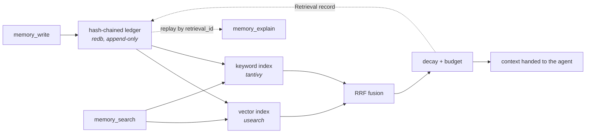

<div align="center">

# MemVault

**A local-first memory engine for AI agents.**
One binary, no service to operate, no network unless you ask for one.

**[swap-mitra.github.io/memvault](https://swap-mitra.github.io/memvault/)**

[](https://github.com/swap-mitra/memvault/actions/workflows/ci.yml)
[](https://github.com/swap-mitra/memvault/actions/workflows/wheels.yml)
[](https://github.com/swap-mitra/memvault/actions/workflows/benchmarks.yml)


[Install](#install) ·
[CLI](#quickstart-1--the-cli-in-about-a-minute) ·
[MCP setup](#quickstart-2--connect-it-to-an-mcp-client) ·
[Python](#quickstart-3--python-in-process) ·
[Accountability](#proving-the-accountability-claims) ·
[Operating it](#operating-it) ·
[Limits](#known-limits) ·
[Benchmarks](#benchmarks) ·
[Changelog](CHANGELOG.md)

</div>

Every fact it holds and every retrieval decision it makes is recorded in an
append-only, hash-chained ledger — so "why did the agent know that?" always
has an answer, and "forget this" is something you can prove rather than
trust.

> [!IMPORTANT]
> MemVault does not call an LLM, extract facts from conversation, or train on
> anything. It stores what you give it and explains what it hands back.

| | |
|---|---|
| 🔍 **Hybrid retrieval** | Vector ANN (`usearch`) and BM25 (`tantivy`), fused by reciprocal rank, weighted by decay, packed to a token budget. |
| 🧾 **Provenance by default** | Every search emits a `retrieval_id`. Every candidate it considered — including the ones it cut — replays from the ledger. |
| ⏳ **Bitemporal** | Ask what was true at a moment, or what the engine *believed* at that moment. Two axes, both queryable. |
| 🔥 **Provable forgetting** | Cryptographic erase: the key dies, the record stays, the chain still verifies. |
| 📦 **One binary** | redb plus local index files, in a directory you own. No daemon, no cloud, no network. |



---

## Install

Every tagged [release](https://github.com/swap-mitra/memvault/releases)
carries prebuilt binaries and Python wheels for Linux x86_64, macOS (Intel
and Apple silicon), and Windows x86_64, with a `SHA256SUMS` file.

**Binaries.** Download the archive for your platform and unpack it. It holds
the two programs, the README, and both licenses; put the directory on your
`PATH` or call them by path. Nothing else to install: no database to
provision, no service to keep alive.

| Binary | What it is |
|---|---|
| `memvault` | CLI: `write`, `search`, `get`, `explain`, `as-of`, `supersede`, `forget`, `verify`, `replay`, `mcp-config` |
| `memvault-server` | MCP server over stdio, for agents to talk to |

**Python.** Download the wheel for your platform from the same release and
install the file, for example:

```sh
pip install https://github.com/swap-mitra/memvault/releases/download/v0.1.0/memvault-0.1.0-cp39-abi3-manylinux_2_28_x86_64.whl
```

The wheel is abi3, so one file covers CPython 3.9 and later. Publishing to
PyPI is set up in the release workflow but not yet enabled, so `pip install
memvault` on its own does not work today.

**From source.** Rust 1.85+ (edition 2024; `rustup update` if `cargo build`
complains) and a C++ toolchain, because the vector index (`usearch`) builds
from source: Xcode command line tools on macOS, `build-essential` on
Debian/Ubuntu, Visual Studio Build Tools on Windows. Python 3.9+ and
`maturin` only if you want the bindings.

```sh
git clone https://github.com/swap-mitra/memvault
cd memvault
cargo build --release                                        # -> target/release/memvault, memvault-server
pip install maturin && maturin build --release -m crates/memvault-ffi/Cargo.toml
pip install --find-links target/wheels memvault              # the Python bindings
```

Add `--features tokenizer` to `cargo build` for real token counts instead of
the byte estimate (see [Known limits](#known-limits)).

The examples below write `memvault`; use `./target/release/memvault` or the
unpacked path if it is not on your `PATH`.

---

## Quickstart 1 — the CLI, in about a minute

No server, no config. Write three facts:

```sh
memvault --data-dir ./my-memory write --namespace project \
  --content "the deploy script lives in ops/deploy.sh"
memvault --data-dir ./my-memory write --namespace project \
  --content "staging runs postgres 16"
memvault --data-dir ./my-memory write --namespace project \
  --content "the on-call rotation is in PagerDuty schedule P7" --pin
```

Each prints the id it assigned:

```console
fact_id: 34e2001b-1603-45c5-abbe-f5fbcf31d4a8
```

Now search, with a deliberately small token budget so you can see something
get cut:

```sh
memvault --data-dir ./my-memory search --namespace project \
  --query "deploy script" --max-tokens 20
```

```console
retrieval_id: f96a229c-4d63-4db8-834d-1b98877611dd
fact_id                              ann_rank   ann_dist  bm25_rk bm25_score       rrf  decay_wt     final       outcome tokens
34e2001b-1603-45c5-abbe-f5fbcf31d4a8        0     0.3518        0     2.2232    0.0328    1.0000    0.0328      Injected     15
fdaa5149-440e-4a42-b2e6-d67653f2871d        1     0.6311        -          -    0.0161    1.0000    0.0161   CutByBudget     17
b5aa16a8-aa14-48cb-917d-1bc5d048f184        2     1.0000        -          -    0.0159    1.0000    0.0159   CutByBudget     11
injected:
  34e2001b-1603-45c5-abbe-f5fbcf31d4a8  the deploy script lives in ops/deploy.sh
```

The `injected:` block underneath is what an agent would put in context. The
table above it is why, and it is the point of the product, so it is worth
reading across:

| Column | Meaning |
|---|---|
| `ann_rank` / `ann_dist` | Where the fact placed on the vector-similarity axis, and how far. `-` means it didn't surface there at all. |
| `bm25_rk` / `bm25_score` | Same, for the keyword axis. Rows with a rank on both axes were found two different ways. |
| `rrf` | The two ranks fused. Ranks only — never raw scores, since a cosine distance and a BM25 score aren't on the same scale. |
| `decay_wt` | How much age discounted it. `1.0000` means no discount — a pinned fact never decays. |
| `final` | `rrf × decay_wt`, what the ordering is actually by. |
| `outcome` | `Injected` made it into the answer. `CutByBudget` lost to the token budget, `CutByK` to the `--k` limit, `FilteredByTime` was no longer valid at query time. |
| `tokens` | What that fact would cost you in context. |

> [!NOTE]
> **Every candidate considered appears here, including the ones that were
> cut.** That is what makes a bad retrieval debuggable instead of mysterious.

---

## Quickstart 2 — connect it to an MCP client

This is the setup an actual agent uses. The CLI prints the client config
for you, with absolute paths filled in:

```sh
memvault --data-dir ./my-memory mcp-config
```

```json
{
  "mcpServers": {
    "memvault": {
      "command": "/absolute/path/to/memvault-server",
      "args": ["/absolute/path/to/my-memory"]
    }
  }
}
```

| Client | Where it goes |
|---|---|
| **Claude Code** | Save as `.mcp.json` in your project root. |
| **Claude Desktop** | Merge into `claude_desktop_config.json`. |
| **Any other MCP client** | Same shape; it is a plain stdio server. |

> [!WARNING]
> If you write the file by hand, use absolute paths for both. The server
> inherits whatever working directory the client happens to launch it from,
> which is rarely the one you expect.

**Semantic search needs an embedding provider.** An LLM cannot produce
embedding vectors itself, so an MCP client on its own gets keyword-only
retrieval. Point the server at any OpenAI-compatible `/embeddings` endpoint
and it embeds every write and every query for you:

```sh
memvault --data-dir ./my-memory mcp-config \
  --embed-url http://localhost:11434/v1 --embed-model nomic-embed-text
```

That adds an `env` block with `MEMVAULT_EMBED_URL` and `MEMVAULT_EMBED_MODEL`
(and `MEMVAULT_EMBED_API_KEY` if the provider wants a bearer token; set it in
the same block). The example is Ollama; `https://api.openai.com/v1` with
`text-embedding-3-small` works the same way. The model's name and width are
stored in the directory the first time, and a different model against the
same directory is refused at startup rather than mixed in. A provider error
fails the call rather than quietly degrading to keyword search.

If your client passes its own embeddings instead, `--embedding-dim 1536`
records the width up front (`MEMVAULT_EMBEDDING_DIM`). Without either, a new
directory gets 32 dimensions, which is what the CLI's stand-in vectors need.

Restart the client, and the agent has seven tools. Every one answers with
JSON in `structuredContent` (mirrored as a text block for older clients),
so the agent reads fields, not columns. The server's instructions tell the
agent when to write, how to recall, and what to do when a fact changes:

| Tool | What it does |
|---|---|
| `memory_write` | Assert a fact, optionally with `valid_from` / `valid_to` (RFC 3339) and an opaque `source`. Pass an existing `fact_id` to supersede that fact instead — it has to be one of this namespace's own. |
| `memory_search` | Hybrid retrieval. Returns `injected`, the facts that made it into the answer with their content, best first, plus `candidates`, the full provenance table above as rows. |
| `memory_get` | One fact's current version by `fact_id`. |
| `memory_as_of` | What was true — or what the engine believed — at a given moment. |
| `memory_supersede` | Close a fact's interval without asserting a replacement. |
| `memory_forget` | Cryptographic erase. |
| `memory_explain` | Reconstruct any past retrieval from its `retrieval_id`. |

On startup the server runs recovery and verifies the chain, logging the
result to stderr. Stdout is the protocol channel and carries nothing else.

<details>
<summary><b>Checking it works without a client</b> — drive the server directly with a smoke script</summary>

<br>

If the agent isn't seeing the tools and you want to know whether the problem
is the server or the client, drive it directly. Save as `smoke.py`:

```python
import json, subprocess, sys

proc = subprocess.Popen(
    ["./target/release/memvault-server", "./my-memory"],
    stdin=subprocess.PIPE, stdout=subprocess.PIPE, text=True,
)

def call(msg, wants_response=True):
    proc.stdin.write(json.dumps(msg) + "\n"); proc.stdin.flush()
    return json.loads(proc.stdout.readline()) if wants_response else None

call({"jsonrpc": "2.0", "id": 0, "method": "initialize", "params": {
    "protocolVersion": "2025-06-18", "capabilities": {},
    "clientInfo": {"name": "smoke", "version": "0.1.0"}}})
call({"jsonrpc": "2.0", "method": "notifications/initialized"}, wants_response=False)

print(call({"jsonrpc": "2.0", "id": 1, "method": "tools/call", "params": {
    "name": "memory_write",
    "arguments": {"namespace": "project",
                  "content": "the deploy script lives in ops/deploy.sh"}}
})["result"]["structuredContent"])

print(json.dumps(call({"jsonrpc": "2.0", "id": 2, "method": "tools/call", "params": {
    "name": "memory_search",
    "arguments": {"namespace": "project", "query": "deploy script"}}
})["result"]["structuredContent"], indent=2))

proc.terminate()
```

```console
memvault-server: recovery report: RecoveryReport { replayed_from: None, rebuilt: [], verified: true } (32 dimensions, embeddings caller-supplied)
{'fact_id': '408d7030-e08b-488d-ba9a-c03f43005a2d'}
{
  "candidates": [
    {
      "ann_distance": null,
      "ann_rank": null,
      "bm25_rank": 0,
      "bm25_score": 0.683245062828064,
      "decay_weight": 1.0,
      "fact_id": "408d7030-e08b-488d-ba9a-c03f43005a2d",
      "final_score": 0.016393441706895828,
      "ledger_seq": 0,
      "outcome": "Injected",
      "rrf_score": 0.016393441706895828,
      "token_cost": 15
    }
  ],
  "injected": [
    {
      "content": "the deploy script lives in ops/deploy.sh",
      "fact_id": "408d7030-e08b-488d-ba9a-c03f43005a2d"
    }
  ],
  "retrieval_id": "bd6fb341-fee5-4b43-8c03-ab3a09e9b61d"
}
```

`injected` is what the agent puts in context. `candidates` is why, one row
per fact considered, the same columns as the CLI table. Three things about
that output surprise people:

**That first line is not an error.** The server reports what recovery found
on stderr every time it starts; `verified: true` means the chain checked out,
and the parenthesis says what embedding width this directory accepts and
where its vectors come from. Only stdout carries protocol traffic.

**Read each response before sending the next request.** The server handles
requests concurrently, so a script that pipes every line in at once can have
its search answered before its write finishes — and get an empty result that
looks like a bug. Real MCP clients already wait per response; hand-rolled
smoke tests are where this bites.

**`ann_rank` is `null` here.** No embedding provider is configured and the
script passed no `embedding`, so only the keyword axis ran. That's a working
configuration, not a broken one — it is just BM25 rather than hybrid
retrieval. Configure `MEMVAULT_EMBED_URL` and `MEMVAULT_EMBED_MODEL` (see
above) and the same script gets a vector rank too. The CLI shows both axes
because it generates a stand-in vector; see [Known limits](#known-limits).

</details>

---

## Quickstart 3 — Python, in-process

For callers who want the engine in the same process, with no subprocess and
no event loop. Install the wheel as described under [Install](#install),
then:

```python
import memvault

# embedding_dim is fixed the first time a directory is created and
# remembered after that; leave it out if you only use keyword search.
mv = memvault.MemVault("./my-memory", embedding_dim=1536)
fact_id = mv.write("project", "the deploy script lives in ops/deploy.sh",
                   embedding=my_model.embed("the deploy script lives in ops/deploy.sh"))

result = mv.search("project", "deploy script", embedding=my_model.embed("deploy script"))
for f in result.injected:          # what goes in context, best first
    print(f.fact_id, f.content)
for e in result.candidates:        # why: every candidate considered
    print(e.fact_id, e.outcome, e.final_score, e.token_cost)

mv.get(fact_id)                    # one fact's current version, or None

mv.verify()  # raises if the chain is broken
```

The API is synchronous, and every call releases the GIL while the engine
works. `Explanation` carries the same fields as the table above, so
provenance doesn't get thinner just because you came in this way. The
embedding provider is a server feature; in-process callers embed with their
own model and pass the vectors in, as above.

---

## Proving the accountability claims

Two of MemVault's three commitments are things you can check yourself rather
than take on faith.

**Any past retrieval reconstructs exactly**, including what was cut, from its
id alone — it's a ledger read, not a re-run:

```sh
memvault --data-dir ./my-memory explain f96a229c-4d63-4db8-834d-1b98877611dd
```

**Forgetting is provable.** Erase a fact, and the chain still verifies:

```sh
memvault --data-dir ./my-memory verify
# chain verified from seq 0

memvault --data-dir ./my-memory forget 34e2001b-1603-45c5-abbe-f5fbcf31d4a8 \
  --reason "customer deletion request"
# forgot fact_id: 34e2001b-1603-45c5-abbe-f5fbcf31d4a8

memvault --data-dir ./my-memory verify
# chain verified from seq 0
```

The fact is gone from search, but its record is still in the ledger — the
history stays honest, and the content is unrecoverable because its key was
destroyed:

```sh
memvault --data-dir ./my-memory dump-record 0
```

```console
seq 0 kind Assert recorded_at 2026-08-17T18:30:07.541767+00:00
fact_id 34e2001b-...  content_hash 76d44f5d...  ciphertext_len 56
content: undecryptable (key destroyed or never existed)
```

> [!TIP]
> The `content_hash` survives, so anyone holding the original plaintext can
> still prove what that record used to say. Nobody can recover it from here.

Two narrated end-to-end demos live in `demo/`, and CI runs both on every push
so they can't rot:

| Script | What it shows |
|---|---|
| `demo/run_demo_1.sh` | Write → search → explain: retrieval and its provenance. |
| `demo/run_demo_2.sh` | `kill -9` mid-write → recovery → verify → forget → verify again. |

---

## Optional: gRPC

<details>
<summary>For multi-process deployments where stdio isn't available. Off by default.</summary>

<br>

```sh
cargo build -p memvault-server --features grpc
MEMVAULT_GRPC_ADDR=127.0.0.1:50051 ./target/debug/memvault-server ./my-memory
```

The same seven operations as the MCP tools, as protobuf messages with the
same shapes as the tools' JSON. The schema is
`crates/memvault-server/proto/memvault.proto`. A default build rejects
`MEMVAULT_GRPC_ADDR` rather than ignoring it, so a half-configured deployment
fails at startup instead of quietly serving the wrong thing.

</details>

---

## Operating it

A data directory is a handful of files you own, and the rules for looking
after it are short.

| | |
|---|---|
| `ledger.redb` | The hash-chained ledger: every fact, supersession, erase and retrieval, encrypted content included. The only file that is the truth. |
| `keys.redb` | One key per fact. `forget` deletes a key here; that is the whole erase. |
| `vectors.usearch`, `vectors.usearch.meta.redb`, `keyword/`, `keyword.watermark` | Derived indexes. Deletable; `memvault replay` (or any server start) rebuilds them from the ledger. |

**Back it up stopped.** The ledger takes an exclusive file lock while a
process has it open, so a second opener fails rather than reading a half-
written state; the same lock means a copy taken while the server runs may
catch an index file mid-write. Stop the server, copy the directory, start
it again. If the copy is ever inconsistent, `replay` fixes the indexes; the
ledger itself is append-only and verified on every open.

**`keys.redb` is the one file you cannot regenerate.** Lose it and every
fact becomes permanently unreadable, though the chain still verifies and
the `content_hash` on each record still proves what it once said. Back it
up with the ledger, and protect it like the plaintext it unlocks.

**Erase is only as strong as your backups.** A backup taken before a
`forget` still holds that fact's key. If provable forgetting matters to you,
your retention policy for backups is part of it.

**Upgrading.** Pre-1.0, the on-disk format may change between minor
versions. [CHANGELOG.md](CHANGELOG.md) says when it does; until then, a
newer binary opens an older directory unchanged.

---

## Known limits

Stated plainly, because each one will otherwise look like a bug.

| Limit | What it means for you |
|---|---|
| **Embeddings come from outside** | MemVault runs no model. The MCP and Python surfaces accept an `embedding`; the server can also fetch one from an OpenAI-compatible provider you configure (`MEMVAULT_EMBED_URL`, `MEMVAULT_EMBED_MODEL`), and without either it falls back to keyword-only retrieval. A data directory has one embedding model and width, set when it is created and refused if contradicted later. The CLI and demos hash trigrams into a vector of that width so the fusion machinery has something to run on — that stand-in is *not* semantically meaningful, and no number produced with it should be read as retrieval quality. |
| **Namespaces isolate results, but share one candidate pool** | A search never returns another namespace's facts. It does draw candidates from indexes shared across the whole data directory and filter afterwards, so a namespace holding far more facts than its neighbours can crowd them out of that pool and cost them recall. Nothing leaks either way; a very lopsided multi-tenant directory is still better off with a `--data-dir` per tenant. |
| **Token counts are estimates by default** | Ciphertext bytes / 4, not a tokenizer. Close enough for budgeting English prose, drifting on code. Build with `--features tokenizer` and the `tokens` column becomes a real cl100k_base count of the decrypted content; the vocabulary is compiled in and no model runs. |
| **Decay measures from a fact's own start** | Not from last access — so retrieval does not yet reinforce a fact against decay. |
| **Every search appends to the ledger** | The Retrieval record that makes `explain` possible is a ledger write, so the chain grows with reads as well as writes, and `verify` and `explain` walk all of it. There is no compaction or checkpointing yet. An agent that searches on every turn will notice `verify` slowing over months, not days; `memvault verify --from <seq>` bounds it in the meantime. |

---

## Benchmarks

> [!IMPORTANT]
> Every number below carries the protocol that produced it. A number
> published without its protocol is marketing.

### Latency, verification, rebuild

`cargo run --release -p memvault-bench` reports the three figures the product
doc commits to, each printed with its own protocol block:

| Figure | What it measures |
|---|---|
| **Retrieval latency, index-only** | p50/p95/p99 over ANN + BM25 + RRF + decay + budget on a warm index, embedding computed outside the timed region. |
| **Retrieval latency, end-to-end** | Same, with embedding generation inside the timed region. |
| **Chain verification throughput** | Records/sec for a full `verify_chain` walk over the corpus. |
| **Index rebuild time** | Wall clock for a full replay of the ledger into empty vector and keyword indexes. |

Flags: `--corpus-size`, `--queries`, `--k`, `--max-tokens`, and `--hardware`
(free text — the harness can name your platform but not your CPU).

<details>
<summary><b>A sample report</b> — one run, one laptop, so run your own before trusting it</summary>

<br>

```console
$ cargo run --release -p memvault-bench -- --corpus-size 2000 --queries 500 \
    --hardware "AMD Ryzen 7 4800H, 8 cores / 16 threads, 16 GB RAM, Windows 11, NVMe SSD"

memvault benchmark report

protocol
  corpus_size          2000 records
  embedding_dimensions 32 dimensions
  embedding_model      hashed-trigram placeholder (not a semantic model)
  k                    10 candidates
  max_tokens           2048 tokens
  hardware             AMD Ryzen 7 4800H, 8 cores / 16 threads, 16 GB RAM, Windows 11, NVMe SSD
  build_profile        release
  ingest               210.429 s for 2000 records

retrieval latency, index-only
  protocol             ANN + BM25 + RRF + decay + budget over a warm index; embedding computed outside the timed region
  samples              500 queries
  p50                  3.261 ms
  p95                  4.121 ms
  p99                  4.762 ms

retrieval latency, end-to-end
  protocol             index-only plus embedding the query text with the model named above
  samples              500 queries
  p50                  3.341 ms
  p95                  8.956 ms
  p99                  23.622 ms

chain verification
  protocol             full BLAKE3 chain walk from genesis to head, single-threaded; the chain holds retrieval records too, so this exceeds corpus_size
  records              3000 records
  elapsed              0.020 s
  throughput           152423.5 records/s

index rebuild, full, from the ledger
  protocol             reset the index, then replay every ledger record into it
  corpus_size          2000 records
  vector (HNSW)        34.063 s
  keyword (tantivy)    0.213 s
  total                34.275 s
```

Read the write-side figures as a known ceiling, not a result: **ingest is
~105 ms per record and vector rebuild ~17 ms per record**, both dominated by
`VectorIndex::insert` serializing the whole HNSW graph to disk on every
insert. That is what buys crash durability at any point in a write, and it is
the obvious thing to batch when bulk loading matters more than that. Read
latency doesn't pay it.

</details>

### Evals — LongMemEval and LOCOMO

`benchmarks/` holds both harnesses and [its own README](benchmarks/README.md).
They replace *only* the memory layer: given a haystack of conversation turns
and a question, they decide what goes into the model's context and write it
out in the shape each benchmark's own scripts consume. Generation and judging
stay with the benchmark, which is what "run unmodified" means.

```sh
# the Python bindings, installed as under Install
python benchmarks/longmemeval.py longmemeval_s.json --out lme_retrievals.jsonl
python benchmarks/locomo.py       locomo10.json      --out locomo_retrievals.jsonl
```

Each prints a summary that reports accuracy's *cost* next to it:

| Summary field | What it tells you |
|---|---|
| `tokens_per_retrieval_call_mean` / `_max` | Context volume per question. |
| `injected_per_call_mean` vs `considered_per_call_mean` | How much of what was found actually fit. |
| `cut_by_budget_total` / `cut_by_k_total` / `filtered_by_time_total` | Why the rest didn't. |
| `input_cost_per_turn_usd` | The retrieved context priced at the input rate of `--model` (default `claude-opus-5`). |
| `token_cost_basis` | Stated in the output itself: MemVault's estimate, not a tokenizer. |

> [!NOTE]
> Neither dataset is redistributed here — get `longmemeval_s.json` and
> `locomo10.json` from their own projects. `--limit N` runs the first N items,
> which is how to check the pipeline before committing to a full run.
> `python benchmarks/test_harnesses.py` exercises both against miniature
> fixtures, no datasets needed.

---

## Layout

```
crates/
  memvault-core/     the engine: ledger, crypto, indexes, read and write paths
  memvault-server/   MCP server over stdio; optional gRPC behind a feature
  memvault-cli/      the memvault binary
  memvault-ffi/      Python bindings (pyo3)
  memvault-bench/    latency, verification, and rebuild benchmarks
benchmarks/          LongMemEval and LOCOMO harnesses
demo/                narrated end-to-end demo scripts
docs/                the landing page (served by GitHub Pages), product doc, implementation plan
.github/workflows/   ci (tests + demos), wheels, release (binaries on a tag), benchmarks
```

## License

MIT OR Apache-2.0, at your option. See [LICENSE-MIT](LICENSE-MIT) and
[LICENSE-APACHE](LICENSE-APACHE).
